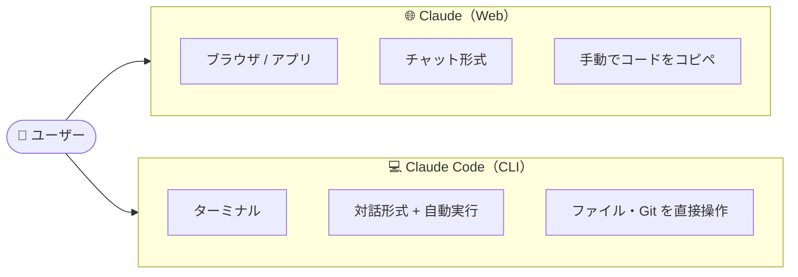
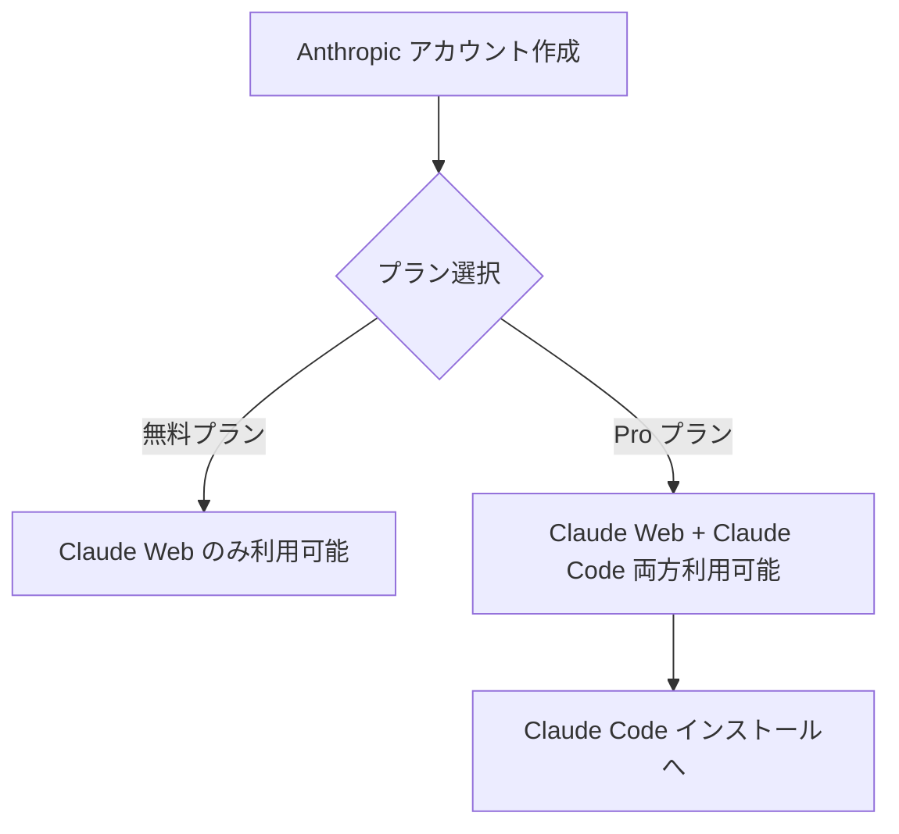
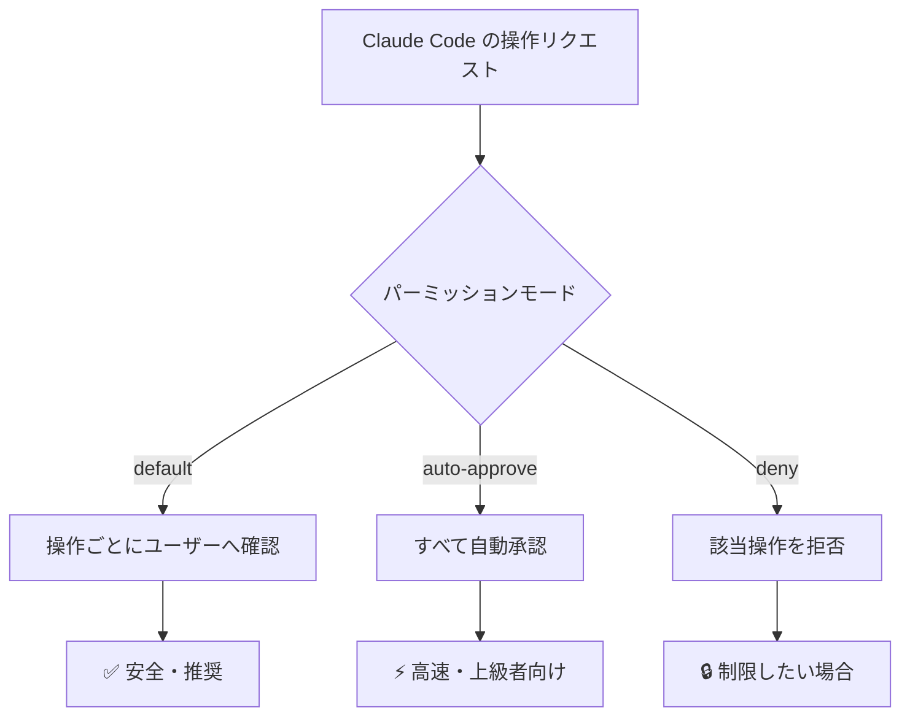
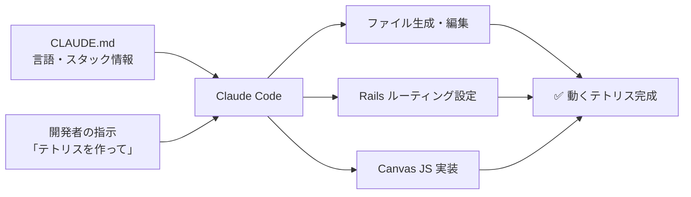
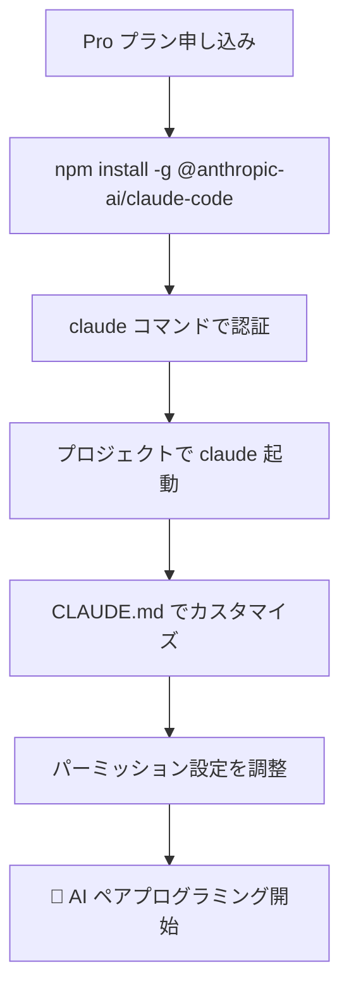

# 初めてのClaude Codeセットアップ

Anthropic が提供する CLI ツール **Claude Code** を使うと、ターミナルから直接 Claude と対話しながらコードを書いたり、ファイルを操作したりできます。この記事では、Claude Code の概要からセットアップ、実践的な活用方法までを解説します。

---

## Claude と Claude Code の違い

まず「Claude」と「Claude Code」は別物です。それぞれの特徴を整理します。

| | Claude（Web / アプリ） | Claude Code（CLI） |
|---|---|---|
| 利用方法 | ブラウザ・スマホアプリ | ターミナル（コマンドライン） |
| 主な用途 | チャット・文章生成・質問 | コーディング・ファイル操作・Git |
| ファイル操作 | 手動でコピペが必要 | プロジェクトのファイルを直接読み書き |
| コマンド実行 | できない | シェルコマンドを直接実行できる |
| 対象ユーザー | 誰でも | 開発者向け |



**Claude Code は「開発作業そのものを AI と一緒にやる」ためのツール**です。コードを書くだけでなく、テストの実行・コミット・ドキュメント更新まで一気通貫で行えます。

---

## 利用には Pro プランが必要

:::message alert
Claude Code を使うには **Claude Pro プラン（有料）** への申し込みが必要です。無料プランでは利用できません。
:::

料金や含まれる機能の詳細は公式の料金ページで確認できます。

https://www.anthropic.com/pricing



Pro プランに申し込んだら、インストールに進みましょう。

---

## 必要なもの

- macOS（または Linux / WSL）
- Node.js v18 以上
- Anthropic アカウント（Pro プラン）

---

## インストール手順

### 1. Node.js のインストール確認

```bash
node -v
# v18.0.0 以上であれば OK
```

Node.js が入っていない場合は [Volta](https://volta.sh/) でインストールするのがおすすめです。

```bash
# Volta を使う場合
curl https://get.volta.sh | bash
volta install node
```

### 2. Claude Code のインストール

```bash
npm install -g @anthropic-ai/claude-code
```

```bash
claude --version
# インストール確認
```

### 3. 認証

```bash
claude
```

初回起動時にブラウザが開き、Anthropic アカウントでの OAuth 認証が求められます。ログイン後、ターミナルに戻ると認証完了です。

---

## 基本的な使い方

プロジェクトディレクトリに移動してから `claude` を起動するだけです。

```bash
cd ~/Project/my-app
claude
```

あとは日本語でそのまま話しかけるだけです。

```
> このファイルのバグを直して
> テストを書いて
> README を更新して
```

### 便利なオプション

| コマンド | 説明 |
|---------|------|
| `claude` | 対話モードで起動 |
| `claude "質問内容"` | 1 回だけ質問して終了 |
| `claude --print "質問"` | 結果をそのままターミナルに出力 |

---

## パーミッション設定

Claude Code はファイルの編集やコマンドの実行といった**実際のシステム操作**を行うため、何を許可するかを適切に設定することが重要です。

### パーミッションの種類



### 設定ファイル（settings.json）

`~/.claude/settings.json` に記述することで、ツールごとに許可・拒否を細かく制御できます。

```json
{
  "permissions": {
    "allow": [
      "Bash(git *)",
      "Bash(npm *)",
      "Read",
      "Edit"
    ],
    "deny": [
      "Bash(rm -rf *)"
    ]
  }
}
```

### 実際の確認ダイアログ

デフォルト設定では、Claude Code がファイルを編集したりコマンドを実行しようとする際に、ターミナル上で確認が求められます。

```
⚠️  Claude wants to run: git push origin main
Allow? [y/n/always/never]
```

- `y` : 今回だけ許可
- `n` : 今回だけ拒否
- `always` : 以後このコマンドは自動承認
- `never` : 以後このコマンドは自動拒否

:::message
初めて使う場合は**デフォルト設定のまま（都度確認）** で始めるのが安全です。操作の流れに慣れてから `always` を活用していきましょう。
:::

---

## CLAUDE.md でプロジェクトをカスタマイズ

プロジェクトルートに `CLAUDE.md` を置くと、Claude Code がそのプロジェクト固有のルールを読み込んでくれます。毎回同じ説明をしなくて済むため、非常に便利です。

### 実例：テトリスをゼロから作る

実際に Claude Code を使って、**テトリスゲームを Rails + Canvas でゼロから作成**しました。`CLAUDE.md` にはスタック情報や言語設定だけを記載し、あとは Claude Code に指示を出すだけです。

```markdown
# CLAUDE.md（テトリスプロジェクトの例）

必ず日本語で作ってください

## 環境
- Ruby 3.2 / Rails 8
- SQLite3
- JavaScript（Canvas API）

## 方針
- ゲームロジックはフロントエンド（バニラ JS）で完結させる
- サーバーサイドは HTML をホストするだけでよい
```

この設定だけで Claude Code は「Rails のルーティングをどうするか」「Canvas の描画をどう実装するか」まで自律的に判断して実装を進めてくれました。



### CLAUDE.md の書き方のコツ

| 項目 | 書くべき内容 |
|------|------------|
| 言語設定 | 「必ず日本語で」などの指示 |
| スタック | Ruby バージョン、フレームワーク名 |
| コーディング規約 | インデント、命名規則 |
| 禁止事項 | 「自動コミットしない」など |

---

## ~/.claude/commands/ でカスタムコマンド

`~/.claude/commands/` ディレクトリに `.md` ファイルを置くと、`/ファイル名` でいつでも呼び出せるカスタムコマンドが作れます。

```
~/.claude/commands/
├── zenn-article-writer.md  # /zenn-article-writer で呼び出せる
└── git-summary.md          # /git-summary で呼び出せる
```

よく使うワークフローをコマンドとして登録しておくと、同じ指示を繰り返す手間が省けます。

---

## まとめ



Claude Code のセットアップはシンプルですが、**パーミッション設定** と **CLAUDE.md** を最初にきちんと整えることで、安全かつ効率よく使えるようになります。

まずは小さなプロジェクトから試してみてください。「テトリスを作って」と一言指示するだけでも、どれだけ強力なツールかを実感できるはずです。
