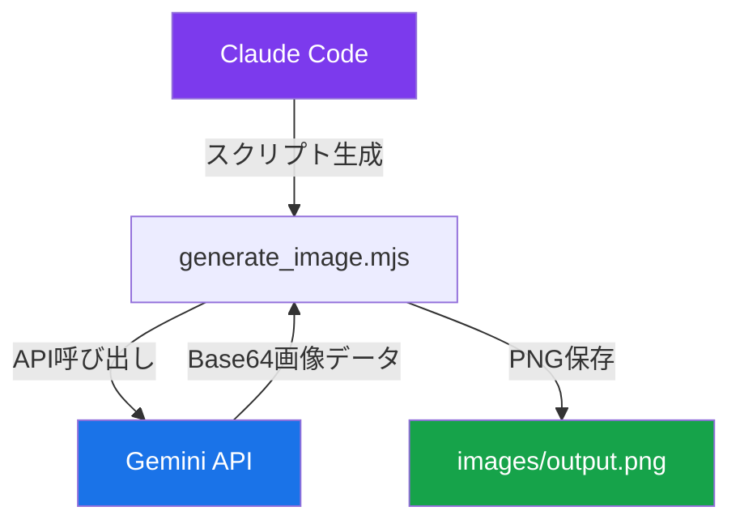
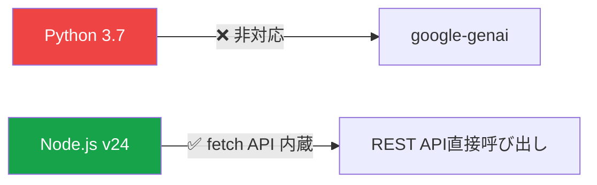
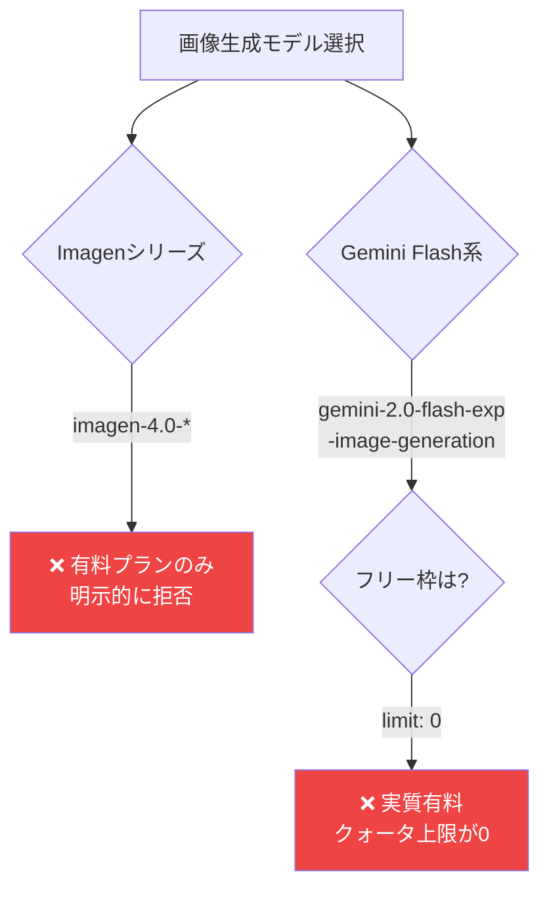
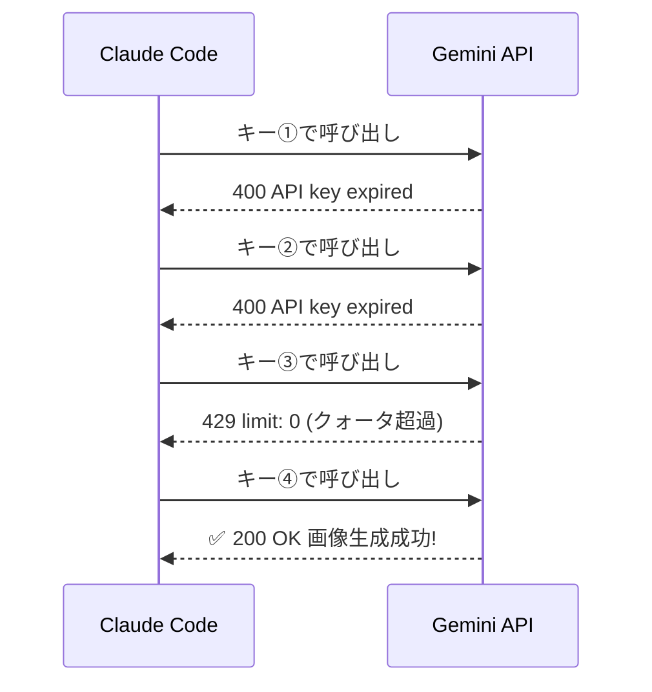
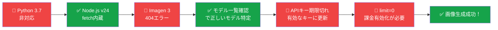

# Claude CodeからGemini APIで画像生成するまでの全記録

Claude Codeを使って、Gemini APIで画像を自動生成することに挑戦しました。
「簡単にできるだろう」と思っていたのですが、思わぬ落とし穴が連続して、実際にはいくつもの壁を乗り越えることになりました。

この記事では、**ハマったポイントも含めて全プロセスを記録**します。同じことをやろうとしている方の参考になれば幸いです。

---

## 全体の流れ



---

## 使用技術

| 項目 | 内容 |
|------|------|
| AI エージェント | Claude Code (claude-sonnet-4-6) |
| 画像生成 API | Google Gemini API |
| モデル | `gemini-2.0-flash-exp-image-generation` |
| 実行環境 | Node.js v24 (ES Modules) |
| 出力形式 | PNG |

---

## Step 1: Pythonで試みる → 失敗

最初はPythonで実装しようとしました。

```bash
$ python3 -c "import google.generativeai"
ModuleNotFoundError: No module named 'google'

$ pip3 install google-genai
ERROR: No matching distribution found for google-genai
```

原因はPythonのバージョンでした。

```bash
$ python3 --version
Python 3.7.9
```

`google-genai` はPython 3.9以上が必要です。Python 3.7では動きません。



**→ Node.jsのネイティブfetchでREST APIを直接呼び出す方針に切り替え**

---

## Step 2: スクリプト作成

Claude Codeに依頼してNode.js製のスクリプトを生成しました。

```javascript
// generate_image.mjs
import fs from 'fs';
import path from 'path';

const API_KEY = process.env.GEMINI_API_KEY;

const prompt = `High resolution, 4K, ultra sharp, professional photorealistic illustration for LinkedIn:
A person sitting at a clean modern desk, laptop screen prominently showing GitHub interface.
...`;

const outputPath = path.join(import.meta.dirname, 'images', 'output.png');

async function generateImage() {
  const response = await fetch(
    `https://generativelanguage.googleapis.com/v1beta/models/gemini-2.0-flash-exp-image-generation:generateContent?key=${API_KEY}`,
    {
      method: 'POST',
      headers: { 'Content-Type': 'application/json' },
      body: JSON.stringify({
        contents: [{ parts: [{ text: prompt }] }],
        generationConfig: { responseModalities: ['IMAGE', 'TEXT'] },
      }),
    }
  );

  const data = await response.json();
  const imagePart = data.candidates[0].content.parts.find(
    p => p.inlineData?.mimeType?.startsWith('image/')
  );

  const ext = imagePart.inlineData.mimeType.split('/')[1];
  fs.writeFileSync(outputPath.replace('.png', `.${ext}`),
    Buffer.from(imagePart.inlineData.data, 'base64'));
  console.log('画像を保存しました');
}

generateImage();
```

:::message
`.mjs` 拡張子はES Modules（`import`/`export`）形式のJavaScriptファイルです。`import.meta.dirname` を使うため `.mjs` にしています。`.js` で書く場合は `package.json` に `"type": "module"` が必要です。
:::

---

## Step 3: APIモデルの選定で詰まる

最初は `imagen-3.0-generate-002` を指定しましたが…

```
404: models/imagen-3.0-generate-002 is not found for API version v1beta
```

利用可能なモデルを確認しました。

```bash
curl "https://generativelanguage.googleapis.com/v1beta/models?key=$GEMINI_API_KEY" | \
  node -e "..." # 画像生成対応モデルだけ抽出
```

結果：

```
models/gemini-2.0-flash-exp-image-generation  ['generateContent', 'countTokens']
models/gemini-2.5-flash-image                 ['generateContent', 'countTokens']
models/gemini-3.1-flash-image-preview         ['generateContent', 'countTokens']
models/imagen-4.0-generate-001                ['predict']
models/imagen-4.0-ultra-generate-001          ['predict']
models/imagen-4.0-fast-generate-001           ['predict']
```

---

## Step 4: 無料 vs 有料の壁



Imagen 4を試すと：

```
400: Imagen 3 is only available on paid plans.
Please upgrade your account at https://ai.dev/projects.
```

`gemini-2.0-flash-exp-image-generation`を試すと：

```
429: Quota exceeded
* limit: 0, model: gemini-2.0-flash-exp
```

**結論：Gemini APIの画像生成は、2026年3月時点で全モデル実質有料**

| モデル | 無料枠 | 備考 |
|--------|--------|------|
| imagen-3.0-generate-002 | ❌ | 旧モデル、APIから削除済み |
| imagen-4.0-fast/generate | ❌ | 明示的に有料のみ |
| gemini-2.0-flash-exp-image-generation | ❌ | limit=0（無料枠なし） |
| gemini-2.5-flash-image | ❌ | おそらく同様 |

---

## Step 5: APIキーの問題も重なった

APIキーの問題も発生しました。



**有効なAPIキーを用意した上で、課金が有効なプロジェクトに紐付ける必要があります。**

[Google AI Studio](https://aistudio.google.com/apikey) でキーの状態を必ず確認しましょう。

---

## Step 6: プロンプト改善で画質向上

初期プロンプト（シンプル版）で生成した画像は品質が低かったため、プロンプトを強化しました。

**Before:**
```
A professional, minimalist illustration for LinkedIn post:
A person at a clean modern desk, laptop screen showing GitHub interface.
Soft blue and white color palette, flat design style.
```

**After:**
```
High resolution, 4K, ultra sharp, professional photorealistic illustration for LinkedIn:
A person sitting at a clean modern desk, laptop screen prominently showing GitHub interface
with neatly organized repositories.
The composition follows the rule of thirds, subject centered with breathing room on the sides.
Color palette: calm blue, white, and light gray tones. Bright, well-lit office environment.
Style: professional, polished, photo-realistic with cinematic lighting.
No text overlays. No watermarks.
```

### 品質を上げるプロンプトのコツ

| カテゴリ | 効果的なキーワード |
|----------|-------------------|
| 解像度 | `high resolution`, `4K`, `ultra sharp` |
| スタイル | `photorealistic`, `cinematic lighting`, `professional` |
| 構図 | `rule of thirds`, `centered`, `breathing room` |
| 除外指定 | `No text overlays`, `No watermarks` |

---

## 完成したスクリプト全体

```javascript
import fs from 'fs';
import path from 'path';

const API_KEY = process.env.GEMINI_API_KEY;
if (!API_KEY) {
  console.error('GEMINI_API_KEY が未設定です');
  process.exit(1);
}

const prompt = `High resolution, 4K, ultra sharp, professional photorealistic illustration for LinkedIn:
A person sitting at a clean modern desk, laptop screen prominently showing GitHub interface with neatly organized repositories.
Scattered Notion-like paper documents on the desk are being transformed into digital GitHub folders — symbolizing a life management migration.
The composition follows the rule of thirds, subject centered with breathing room on the sides.
Color palette: calm blue, white, and light gray tones. Bright, well-lit office environment.
Style: professional, polished, photo-realistic with cinematic lighting. No text overlays. No watermarks.`;

const outputDir = path.join(import.meta.dirname, 'images');
const outputPath = path.join(outputDir, 'output.png');

async function generateImage() {
  console.log('Gemini 2.0 Flash Image Generation で生成中...');

  const response = await fetch(
    `https://generativelanguage.googleapis.com/v1beta/models/gemini-2.0-flash-exp-image-generation:generateContent?key=${API_KEY}`,
    {
      method: 'POST',
      headers: { 'Content-Type': 'application/json' },
      body: JSON.stringify({
        contents: [{ parts: [{ text: prompt }] }],
        generationConfig: { responseModalities: ['IMAGE', 'TEXT'] },
      }),
    }
  );

  if (!response.ok) {
    const err = await response.text();
    console.error('API エラー:', response.status, err);
    process.exit(1);
  }

  const data = await response.json();
  const parts = data.candidates?.[0]?.content?.parts ?? [];
  const imagePart = parts.find(p => p.inlineData?.mimeType?.startsWith('image/'));

  if (!imagePart) {
    console.error('画像データが見つかりません');
    process.exit(1);
  }

  const ext = imagePart.inlineData.mimeType.split('/')[1];
  const finalPath = outputPath.replace('.png', `.${ext}`);
  fs.writeFileSync(finalPath, Buffer.from(imagePart.inlineData.data, 'base64'));
  console.log(`画像を保存しました: ${finalPath}`);
}

generateImage();
```

### 実行方法

```bash
GEMINI_API_KEY="your-api-key" node generate_image.mjs
```

---

## まとめ



**ハマりポイントのまとめ：**

1. **Python 3.7 では `google-genai` が使えない** → Node.js の fetch API で REST 直接呼び出し
2. **Imagen 3 (`imagen-3.0-generate-002`) はAPIから削除済み** → `ListModels` で現行モデルを確認
3. **Gemini の画像生成は無料枠なし** → 課金有効化が必須
4. **APIキーの期限切れに注意** → Google AI Studio で定期的に確認
5. **プロンプトの品質が画像品質に直結** → `4K`, `photorealistic` などのキーワードが有効

---

Claude Codeはスクリプトの生成・エラーの解析・修正を全て対話形式でこなしてくれました。自分でAPIドキュメントを読み込む必要がなく、エラーメッセージを貼り付けるだけで次の手を提案してくれる体験は、開発の敷居を大幅に下げてくれると感じました。
